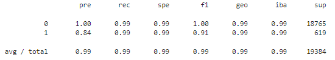

# Credit Risk Analysis Report

## Overview of the Analysis

* **Purpose of the analysis**:
Credit risk poses a classification problem that’s inherently imbalanced, since healthy loans easily outnumber risky loans. In this analysis, we’ll use various techniques to train and evaluate models with imbalanced data from lending cases.

* **Financial data and predictions**: 
We are using a dataset of historical lending activity from a peer-to-peer lending services company (the `lending_data.csv` data inside the `Resources` folder) to build a model that can identify the creditworthiness of borrowers.

* **Basic information about the variables we are trying to predict**: 
The variable we want to predict is the 'loan_status': A value of `0` in the “loan_status” column means that the loan is healthy. A value of `1` means that the loan has a high risk of defaulting.

For the existing dataset, the distribution in this variable is as follows (clearly very imbalanced):

* **Stages of the machine learning process for this analysis**: 
For each part of the analysis we complete the following steps:

1. Read the `lending_data.csv` data from the `Resources` folder into a Pandas DataFrame.
2. Create the labels set (`y`)  from the “loan_status” column, and then create the features (`X`) DataFrame from the remaining columns.
3. Check the balance of the labels variable (`y`) by using the `value_counts` function.
4. Split the data into training and testing datasets by using `train_test_split`.
5. Fit a logistic regression model by using the training data (`X_train` and `y_train`).
6. Save the predictions on the testing data labels by using the testing feature data (`X_test`) and the fitted model.
7. Evaluate the model’s performance by checking the accuracy score of the model, the confusion matrix and the classification report.

* **Methods**: 
In this case, we try two approaches:

1. Create a `Logistic Regression` Model with the Original Data.
2. Predict a `Logistic Regression` Model with Resampled Training Data using the `RandomOverSampler` module from the imbalanced-learn library.

---

## Results

* **Model 1 (Logistic Regression with original data)**:

Based on the classification report, the logistic regression model appears to be performing very well for the 0 (healthy loan) label, with a precision of 1.00 and a recall of 0.99. This means that the model is correctly identifying almost all of the healthy loans, and very few healthy loans are being incorrectly classified as high-risk loans.

For the 1 (high-risk loan) label, the model has a lower precision of 0.85 and a higher recall of 0.91. This means that while the model is correctly identifying a high proportion of the high-risk loans, there is a higher rate of false positives, meaning some loans that are actually healthy are being classified as high-risk.

Overall, the model has an accuracy of 0.99 and a weighted average F1-score of 0.99, which indicates that it is performing very well overall.

* **Model 2 (Logistic Regression with resampled data)**:

  
  
This model has a higher recall for the 1 (high-risk loan) label, with a value of 0.99 instead of 0.91, indicating that almost all of the high-risk loans are being correctly identified by the model. However, this comes at the expense of a slightly lower precision value of 0.84, indicating that there is a higher rate of false positives for high-risk loans, compared to the previous model.

The other performance metrics, such as accuracy and weighted average F1-score, remain the same as the previous model. The macro average F1-score is slightly lower in this case, which may be due to the lower precision for high-risk loans.

---

## Summary

Overall, the oversampled model appears to be better at identifying high-risk loans (which is te most important thing we want to predict in this analysis), but it comes with a trade-off of a higher false positive rate. However, in both models, it's important to keep in mind that the class distribution is heavily imbalanced, and further evaluation may be needed to ensure that the model is not overly biased towards the majority class.
